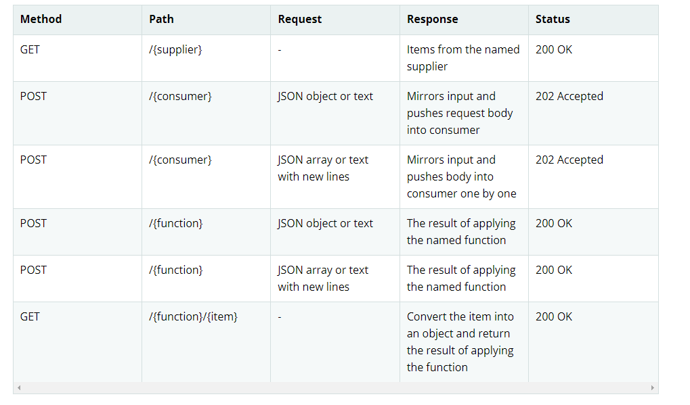

[https://docs.spring.io/spring-cloud-function/docs/3.1.1/reference/html/spring-cloud-function.html](https://docs.spring.io/spring-cloud-function/docs/3.1.1/reference/html/spring-cloud-function.html)

#[Spring Cloud Function](https://docs.spring.io/spring-cloud-function/docs/3.1.1/reference/html/spring-cloud-function.html)

_Spring Cloud Function_ is a project with the following high-level goals:

`1. Promote the implementation of business logic via functions.`

`2. Decouple the development lifecycle of business logic from any specific runtime target so that the same code can run as a web endpoint, a stream processor, or a task.`

`3. Support a uniform programming model across serverless providers, as well as the ability to run standalone (locally or in a PaaS).`

`4. Enable Spring Boot features (auto-configuration, dependency injection, metrics) on serverless providers.`

###Spring Cloud Function embraces and builds on top of the 3 core functional interfaces -

    Supplier<O>
    
    Function<I, O>
    
    Consumer<I>

##Function Component Scan
    Spring Cloud Function will scan for implementations of Function, Consumer and Supplier in a package called "functions" if it exists. 
    Using this feature you can write functions that have no dependencies on Spring - not even the @Component annotation is needed.
    If you want to use a different package, you can set "spring.cloud.function.scan.packages".
    You can also use spring.cloud.function.scan.enabled=false to switch off the scan completely.

##Standalone Web Applications
Functions could be automatically exported as HTTP endpoints.

There is also a spring-cloud-starter-function-web to collect all the optional dependencies in case you just want a simple getting started experience.

https://docs.spring.io/spring-cloud-function/docs/3.1.1/reference/html/spring-cloud-function.html#_standalone_web_applications

###Note : 
    
    1. we can declare functions as bean but they could be either Function<T,R>, Supplier<T> or Consumer<R> .
    2. In case of reactive programming they should have Flux like - Function<Flux<T>,Flux<R>>, Supplier<Flux<T>> or Consumer<Flux<R>> .
    3. By default we can create them in main class file or they in a package called functions
    4. We can also define classed that extends one in these 3 functional interfaces then we can define the package name in 
        properties file as spring.cloud.function.scan.packages = package-name
    5. These function names can work as http endpoints.
    6. We can also use pojo classes as arguments

